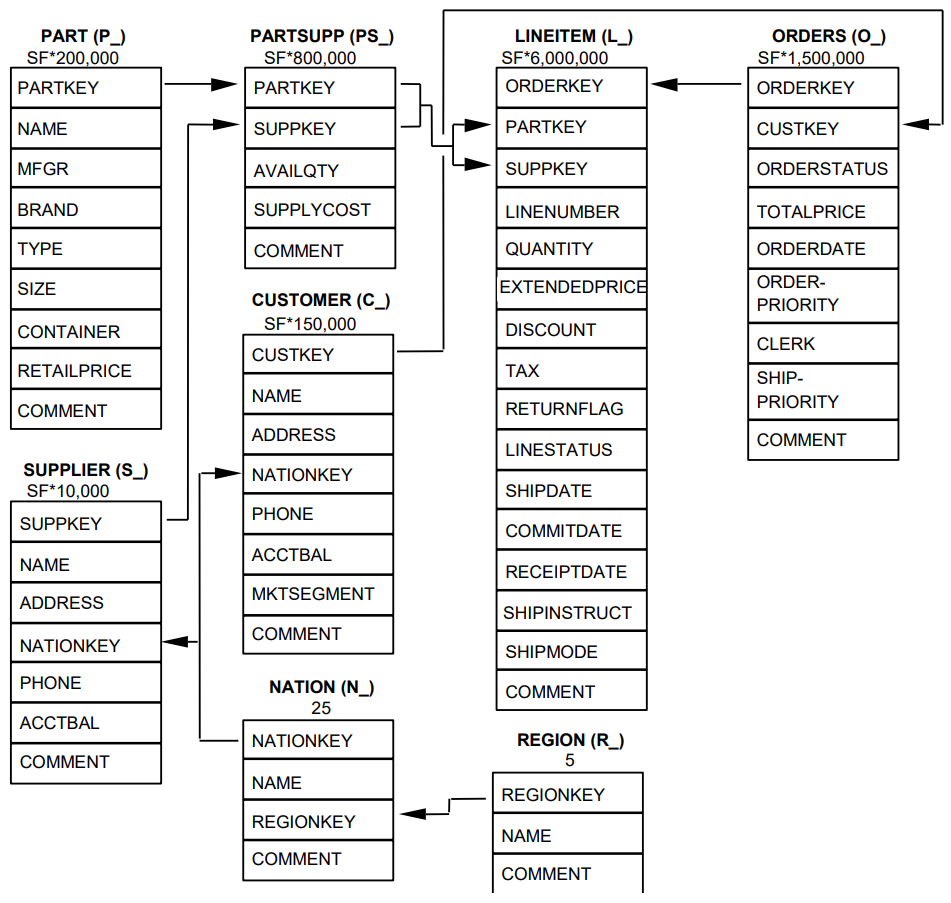

The TPC Benchmark™H (TPC-H) consists of a set of tables that are commonly used in performance testing and benchmarking of database systems. Here is a brief description of the TPC-H tables:

1. **Customer** : Contains information about customers, including their names, addresses, phone numbers, and demographic data.
2. **Orders** : Stores details about customer orders, such as order numbers, order dates, order priorities, and other order-related information.
3. **Lineitem** : Represents the line items of each order, including information about the ordered part, supplier, quantity, price, shipping dates, and other line item details.
4. **Part** : Contains information about parts, including part numbers, names, sizes, types, and other part-related attributes.
5. **Supplier** : Stores data about suppliers, including their names, addresses, phone numbers, and other supplier-related information.
6. **Partsupp** : Represents the relationship between parts and suppliers, indicating which suppliers provide which parts. It includes information such as availability, price, and other part-supplier details.
7. **Nation** : Contains information about nations, including nation keys, names, regions, and other nation-related attributes.
8. **Region** : Stores information about regions, including region keys and names.

These tables are designed to simulate a typical decision support system scenario, where data is stored and queried for complex analytical tasks. They provide a standardized and representative dataset for evaluating the performance and scalability of database systems.

The Schema of the TPC-H tables is shown below:

